# NSS - Nexus Sovereign Standard v3.1.1

[](LICENSE)
[-yellow.svg)](#compliance-ratings)
[-yellow.svg)](#compliance-ratings)
[](https://github.com/LEEI1337/NSS/releases)
[](#)
[](https://www.python.org/)
[](#test-suite)
[](https://github.com/LEEI1337/NSS/actions)
[](https://github.com/LEEI1337/NSS/actions)
[](https://github.com/LEEI1337/NSS/actions)
[](https://codecov.io/gh/LEEI1337/NSS)

**Sovereign, GDPR-compliant AI infrastructure standard for the European Union.**

> **Status: Concept / RFC** -- NSS v3.1.1 is a **conceptual standard and reference architecture**. It has **not been independently tested, audited, or verified** by third parties. The code in this repository is a reference implementation for demonstration purposes. Compliance ratings are self-assessed design targets, not certified results. Contributions, feedback, and peer review are welcome.

---

## Overview

NSS (Nexus Sovereign Standard) proposes a **6-layer defensive architecture** with **Guardian Shield** for enterprise AI deployments. It is designed around **Mistral AI** models with local **Ollama** inference, targeting zero Cloud Act exposure and full EU data sovereignty.

NSS is a conceptual framework designed to meet European regulatory requirements, including GDPR and the EU AI Act. The architecture targets privacy-by-design principles at every layer, from knowledge storage through cognitive processing to governance oversight. All components are designed to operate within EU borders. **This is a design specification and reference implementation -- production readiness requires independent security audits, penetration testing, and compliance certification.**

---

## Architecture

```
+=====================================================================+
|                   Cross-Cutting Concerns                            |
|   JWT Auth (RBAC)  |  HMAC Signing  |  Audit (SHA-256 + Redis)     |
|   Metrics (Prometheus) | Cache | TLS 1.3 | Policy Engine            |
|   Middleware: SecurityHeaders | Tracing | RateLimit                 |
+=====================================================================+
|                    Layer 5: Governance Plane [:11339]                |
|        Policy Engine (OPA)  |  Privacy Budget  |  DPIA Generator    |
+=====================================================================+
|                    Layer 4: Guardian Shield [:11338]                 |
|     MARS        | APEX       | SENTINEL    | SHIELD    | VIGIL     |
|   (Risk Score)  (Model Route) (3-Method     (Defensive   (Tool      |
|                               Injection     Tokens)     Safety CIA) |
|                               Defense)                              |
+=====================================================================+
|                    Layer 3: Cognitive Gateway [:11337]               |
|    PII Redaction | STEER Transform | PNC Compression | HMAC Sign   |
+=====================================================================+
|                    Layer 2: Agent Execution                          |
|        DPSparseVoteRAG (DP Noise)  |  Tool Sandbox (WASM sim)      |
+=====================================================================+
|                    Layer 1: Knowledge Fabric [:6333]                 |
|  Qdrant Vector DB | SAG Encryption (AES-256-GCM) | RAG Pipeline    |
|  Sentence-Transformer Embeddings | Retention Policy (90d)           |
+=====================================================================+
|                    Metrics Server [:11340]                           |
+=====================================================================+
```

### 🏗️ Architecture Visualization (Mermaid Diagrams)
(Mermaid Diagrams)

#### Layer Stack (Data Flow)

```mermaid
graph TD
    A["👤 Client Request"] -->|HMAC Signed| B["Layer 3: Cognitive Gateway<br/>(PII Redaction, STEER, PNC)"]
    B -->|Sanitized| C["Layer 4: Guardian Shield<br/>(MARS, APEX, SENTINEL,<br/>SHIELD, VIGIL)"]
    C -->|Risk Assessed| D["Layer 5: Governance Plane<br/>(Policy Engine, Privacy Budget,<br/>DPIA, Audit)"]
    D -->|Approved| E["Layer 2: Agent Execution<br/>(DPSparseVoteRAG, Tool Sandbox)"]
    E -->|Query| F["Layer 1: Knowledge Fabric<br/>(Qdrant VectorDB, SAG Encryption,<br/>RAG Pipeline)"]
    F -->|Results| G["🔄 Response Pipeline"]
    G -->|Encrypted| H["✅ Client Response"]
    
    style A fill:#e1f5ff,color:#000
    style B fill:#fff3e0,color:#000
    style C fill:#ffe0b2,color:#000
    style D fill:#f3e5f5,color:#000
    style E fill:#e8f5e9,color:#000
    style F fill:#fce4ec,color:#000
    style H fill:#c8e6c9,color:#000
```



#### Guardian Shield Defense Mechanisms

```mermaid
graph LR
    Input["🔍 Incoming Request"]
    
    Input --> MARS["⚡ MARS<br/>Risk Scoring<br/>0.0-1.0"]
    Input --> SENTINEL["🛡️ SENTINEL<br/>Injection Defense<br/>Regex + LLM + Embedding"]
    Input --> VIGIL["👁️ VIGIL<br/>Tool CIA Check<br/>Confidentiality, Integrity,<br/>Availability"]
    
    MARS -->|Score < 0.7| PASS1{"Safe?"}
    SENTINEL -->|No Injection| PASS2{"Safe?"}
    VIGIL -->|Tool Allowed| PASS3{"Safe?"}
    
    PASS1 -->|Yes| APEX["🔀 APEX<br/>Model Routing<br/>Cost Optimization"]
    PASS2 -->|Yes| APEX
    PASS3 -->|Yes| APEX
    
    PASS1 -->|No| SHIELD["⛔ SHIELD<br/>Defensive Tokens<br/>Wrap & Block"]
    PASS2 -->|No| SHIELD
    PASS3 -->|No| SHIELD
    
    APEX -->|Route to Best Model| LLM["🤖 LLM<br/>Inference"]
    SHIELD -->|Blocked| BLOCK["❌ Request Denied"]
    
    style Input fill:#e3f2fd,color:#000
    style MARS fill:#fff9c4,color:#000
    style SENTINEL fill:#ffccbc,color:#000
    style VIGIL fill:#f8bbd0,color:#000
    style APEX fill:#c8e6c9,color:#000
    style SHIELD fill:#ffcdd2,color:#000
    style LLM fill:#b3e5fc,color:#000
    style BLOCK fill:#d32f2f,color:#000
```



#### Microservice Communication

```mermaid
 graph TD
    CG["🚪 Cognitive Gateway<br/>:11337<br/>External"] -->|HTTP| GS["🛡️ Guardian Shield<br/>:11338<br/>Internal"]
    CG -->|HTTP| GP["📋 Governance Plane<br/>:11339<br/>Internal"]
    CG -->|gRPC| QD["🔍 Qdrant VectorDB<br/>:6333<br/>Internal"]
    CG -->|Redis Proto| RC["⚡ Redis Cache<br/>:6379<br/>Internal"]
    GS -->|HTTP| GP
    
    MS["📊 Metrics Server<br/>:11340"] -.->|Collects| GS
    MS -.->|Collects| GP
    MS -.->|Collects| CG
    
    style CG fill:#e3f2fd,color:#000
    style GS fill:#fff3e0,color:#000
    style GP fill:#f3e5f5,color:#000
    style QD fill:#fce4ec,color:#000
    style RC fill:#fff9c4,color:#000
    style MS fill:#e0f2f1,color:#000
```




#### Privacy & Compliance Flow

```mermaid
graph TD
    A["📝 User Request<br/>Privacy Tier: 0-3"] --> B["🔐 Privacy Budget<br/>Check Epsilon Budget"]
    B -->|Budget OK| C["📊 DPIA Generator<br/>Auto-generate Art. 35<br/>Report"]
    B -->|Budget Exhausted| D["⛔ Request Blocked<br/>Privacy Limit Exceeded"]
    
    C --> E["🔎 Differential Privacy<br/>Add Laplace Noise<br/>to RAG Results"]
    E --> F["📉 Privacy Budget<br/>Consume Epsilon"]
    F --> G["🗑️ Retention Policy<br/>Schedule Deletion<br/>90 days default"]
    G --> H["✅ Compliant Response"]
    
    style A fill:#e1f5ff,color:#000
    style B fill:#fff3e0,color:#000
    style D fill:#ffcdd2,color:#000
    style C fill:#f3e5f5,color:#000
    style E fill:#e8f5e9,color:#000
    style F fill:#fce4ec,color:#000
    style H fill:#c8e6c9,color:#000
```



Each layer enforces strict isolation boundaries. Requests flow upward from the Knowledge Fabric through Agent Execution, are filtered by the Cognitive Gateway, protected by Guardian Shield, and governed by the Governance Plane. No layer can be bypassed.

---

## Microservice Architecture

| Service | Port | Bind | Description |
|---------|------|------|-------------|
| **Cognitive Gateway** | `11337` | External (only entry point) | PII redaction, STEER, PNC, HMAC, pipeline orchestration |
| **Guardian Shield** | `11338` | Internal (`127.0.0.1`) | MARS scoring, SENTINEL check, APEX routing, SHIELD, VIGIL |
| **Governance Plane** | `11339` | Internal (`127.0.0.1`) | Policy evaluation, privacy budget, DPIA, audit trail |
| **Metrics Server** | `11340` | Internal (`127.0.0.1`) | Prometheus-compatible operational metrics |
| **Qdrant Vector DB** | `6333` | Internal (`127.0.0.1`) | SAG-encrypted vector storage for RAG |

See [Port Schema](docs/architecture/port-schema.md) for network isolation and firewall configuration.

---

## Key Features

- **Europa-First Architecture** -- Mistral AI foundation models with Ollama local inference; no US Cloud Act exposure
- **6-Layer Security** -- Guardian Shield with MARS, APEX, SENTINEL, SHIELD, and VIGIL subsystems
- **GDPR-Native Design** -- 98/100 compliance rating with built-in PII redaction, privacy budgets, and DPIA automation
- **EU AI Act Aligned** -- 96/100 compliance rating with full transparency, auditability, and risk classification
- **Cost Optimization** -- Up to 66% API cost savings via APEX intelligent model routing
- **Differential Privacy** -- Laplace noise in RAG queries with per-user epsilon budget tracking
- **Immutable Audit Trail** -- SHA-256 hash-chain audit logging with optional Redis persistence for tamper-evident compliance
- **SAG Encryption** -- AES-256-GCM encryption of vector payloads at rest in the Knowledge Fabric
- **RAG Pipeline** -- Retrieval-Augmented Generation with encrypted document storage and context injection
- **GDPR Art. 17 Unlearning** -- Automated right-to-be-forgotten orchestrator (budget reset + vector deletion)
- **Vector Retention Policy** -- Automatic cleanup of expired vectors (configurable, default 90 days)
- **Prometheus Metrics** -- OpenMetrics text format export for monitoring integration
- **TLS 1.3 Ready** -- Optional TLS configuration for all microservices
- **Open Source + Commercial Support** -- Dual-licensed under AGPL-3.0 and Commercial License

---

## Quick Start

```bash
# Clone the repository
git clone https://github.com/LEEI1337/NSS.git
cd NSS

# Install NSS with development dependencies
pip install -e ".[dev]"

# Pull required Mistral models via Ollama
ollama pull mistral:7b-instruct-v0.3
ollama pull mistral-nemo:12b

# Start external dependencies (Qdrant + Redis)
docker compose -f docker/docker-compose.yml up -d qdrant redis

# Start the services (each in a separate terminal)
python -m nss.gateway.server          # Gateway on :11337
python -m nss.guardian.server          # Guardian on :11338
python -m nss.governance.server        # Governance on :11339
python -m nss.metrics_server           # Metrics on :11340
```

> **Prerequisites:** Python 3.11+, [Ollama](https://ollama.ai/) installed and running, Docker (for Qdrant and Redis).

### Verify Installation

```bash
# Health checks
curl http://127.0.0.1:11337/health
curl http://127.0.0.1:11338/health
curl http://127.0.0.1:11339/health
curl http://127.0.0.1:11340/health

# Example: Process a request through the full pipeline (requires JWT + HMAC)
curl -X POST http://127.0.0.1:11337/v1/process \
  -H "Content-Type: application/json" \
  -H "Authorization: Bearer <JWT_TOKEN>" \
  -H "X-HMAC-Signature: <HMAC_SIG>" \
  -d '{"user_id": "user-1", "message": "Was ist GDPR?", "privacy_tier": 1}'

# Example: Check Guardian Shield directly (requires JWT)
curl -X POST http://127.0.0.1:11338/v1/shield/enhance \
  -H "Content-Type: application/json" \
  -H "Authorization: Bearer <JWT_TOKEN>" \
  -d '{"prompt": "Explain data sovereignty"}'

# Example: Evaluate a governance policy (requires JWT)
curl -X POST http://127.0.0.1:11339/v1/policy/evaluate \
  -H "Content-Type: application/json" \
  -H "Authorization: Bearer <JWT_TOKEN>" \
  -d '{"role": "viewer", "pii_detected": true, "privacy_tier": 0}'

# Example: Prometheus metrics (no auth required)
curl http://127.0.0.1:11340/metrics/prometheus
```

### Run Tests

```bash
# Run all 209 tests
make test

# Run with coverage report
make test-cov

# Run only integration tests
python -m pytest tests/test_integration/ -v

# Linting and type checking
make lint
make typecheck
```

---

## API Endpoints

### Cognitive Gateway (`:11337`)

| Method | Endpoint | Description |
|--------|----------|-------------|
| `GET` | `/health` | Liveness/readiness probe |
| `GET` | `/metrics` | Operational metrics |
| `POST` | `/v1/process` | Full 6-layer pipeline (HMAC → Policy → PII → SENTINEL → MARS → APEX → SHIELD → LLM → Budget) |
| `POST` | `/v1/tools/execute` | Sandboxed tool execution with VIGIL pre-check |
| `POST` | `/v1/unlearn/{user_id}` | GDPR Art. 17 right-to-be-forgotten orchestrator |

### Guardian Shield (`:11338`)

| Method | Endpoint | Description |
|--------|----------|-------------|
| `GET` | `/health` | Service health check |
| `POST` | `/v1/mars/score` | MARS risk scoring (0-1 score, tier 0-3) |
| `POST` | `/v1/sentinel/check` | SENTINEL 3-method injection defense |
| `POST` | `/v1/apex/route` | APEX intelligent model routing |
| `POST` | `/v1/shield/enhance` | SHIELD defensive token wrapping |
| `POST` | `/v1/vigil/check` | VIGIL tool-call CIA validation |

### Governance Plane (`:11339`)

| Method | Endpoint | Description |
|--------|----------|-------------|
| `GET` | `/health` | Service health check |
| `POST` | `/v1/policy/evaluate` | OPA-style policy evaluation (role, risk, PII, tools) |
| `GET` | `/v1/privacy/budget/{user_id}` | Remaining epsilon budget for a user |
| `POST` | `/v1/privacy/consume` | Consume epsilon from privacy budget |
| `POST` | `/v1/dpia/generate` | Generate GDPR Art. 35 DPIA report |
| `GET` | `/v1/audit/{audit_id}` | Retrieve specific audit trail entry |
| `GET` | `/v1/audit` | Retrieve all audit trail entries |

### Metrics Server (`:11340`)

| Method | Endpoint | Description |
|--------|----------|-------------|
| `GET` | `/health` | Service health check |
| `GET` | `/metrics` | Full metrics snapshot (counters + histograms) |
| `GET` | `/metrics/prometheus` | Prometheus/OpenMetrics text format export |

---

## Module Reference

### Layer 3: Cognitive Gateway

| Module | File | Description |
|--------|------|-------------|
| Gateway Server | `src/nss/gateway/server.py` | FastAPI pipeline orchestrator, entry point for all requests |
| PII Redaction | `src/nss/gateway/pii_redaction.py` | Regex-based detection and redaction of emails, phones, IBANs, credit cards, IPv4 |
| STEER | `src/nss/gateway/steer.py` | Structured Transformation: language detection (DE/EN), privacy-tier context injection, normalization |
| PNC Compression | `src/nss/gateway/pnc_compression.py` | Prompt Normalization and Compression: deduplication, filler removal, token budget truncation |
| HMAC Signing | `src/nss/gateway/hmac_signing.py` | HMAC-SHA256 request signing and verification with timestamp-based replay protection |

### Layer 4: Guardian Shield

| Module | File | Description |
|--------|------|-------------|
| Guardian Server | `src/nss/guardian/server.py` | FastAPI microservice exposing all Guardian components |
| MARS | `src/nss/guardian/mars.py` | Model Audit & Risk Scoring: LLM-assisted risk evaluation (score 0-1, tier 0-3) |
| APEX | `src/nss/guardian/apex.py` | Adaptive Processing & Execution: intelligent model routing with cost optimization |
| SENTINEL | `src/nss/guardian/sentinel.py` | 3-method injection defense: regex rules + LLM analysis + embedding cosine similarity |
| SHIELD | `src/nss/guardian/shield.py` | Defensive token injection: prepend/append safety tokens around user prompts |
| VIGIL | `src/nss/guardian/vigil.py` | Tool-call safety validator: CIA triad (Confidentiality, Integrity, Availability) |

### Layer 5: Governance Plane

| Module | File | Description |
|--------|------|-------------|
| Governance Server | `src/nss/governance/server.py` | FastAPI microservice for governance endpoints |
| Policy Engine | `src/nss/governance/policy_engine.py` | OPA/Rego simulation: role-based risk limits, PII privacy tiers, tool allowlists |
| Privacy Budget | `src/nss/governance/privacy_budget.py` | Per-user differential privacy epsilon budget tracking with optional Redis persistence |
| DPIA Generator | `src/nss/governance/dpia.py` | GDPR Article 35 DPIA auto-generation with 5 sections and markdown export |

### Layer 2: Agent Execution

| Module | File | Description |
|--------|------|-------------|
| DPSparseVoteRAG | `src/nss/agent/dp_sparse_vote.py` | Differentially private RAG: Laplace noise on similarity scores, budget tracking |
| Tool Sandbox | `src/nss/agent/tool_isolation.py` | WASM/WASI simulation via ProcessPoolExecutor with VIGIL pre-check and timeouts |

### Layer 1: Knowledge Fabric

| Module | File | Description |
|--------|------|-------------|
| Vector Store | `src/nss/knowledge/vector_store.py` | Qdrant wrapper with GDPR Art. 17 right-to-erasure, retention policy, auto-timestamps |
| Embeddings | `src/nss/knowledge/embeddings.py` | Sentence-transformer embedding service (all-MiniLM-L6-v2) |
| SAG Encryption | `src/nss/knowledge/sag_encryption.py` | AES-256-GCM encryption/decryption of vector payloads at rest |
| RAG Pipeline | `src/nss/knowledge/rag_pipeline.py` | Retrieval-Augmented Generation: embed → search → decrypt → augment prompt |

### Cross-Cutting Infrastructure

| Module | File | Description |
|--------|------|-------------|
| Config | `src/nss/config.py` | Environment-based configuration with `NSS_` prefix |
| Models | `src/nss/models.py` | Pydantic v2 data models (NSSRequest, NSSResponse, RiskScore, SentinelResult, etc.) |
| Auth | `src/nss/auth.py` | JWT creation/verification (HS256, 15min), RBAC (Admin/DataProcessor/Auditor/Viewer) |
| Audit | `src/nss/audit.py` | Immutable audit logging with SHA-256 hash-chain and optional Redis persistence |
| Metrics | `src/nss/metrics.py` | Lightweight Counter/Histogram registry with snapshot export |
| Middleware | `src/nss/middleware.py` | SecurityHeaders, TracingMiddleware (X-Trace-ID), RateLimitMiddleware (sliding window) |
| Cache | `src/nss/cache.py` | Redis async caching with graceful degradation (no-op when unavailable) |
| Metrics Server | `src/nss/metrics_server.py` | Dedicated FastAPI metrics endpoint |
| LLM Client | `src/nss/llm/ollama_client.py` | Async Ollama client with health checks and confidence extraction |
| Model Config | `src/nss/llm/model_config.py` | Model tier definitions for APEX routing decisions |

---

## Test Suite

**209 tests** across **35 test files**, organized by layer:

| Category | Tests | Description |
|----------|-------|-------------|
| Gateway | 20 | PII redaction, HMAC signing, STEER, PNC compression |
| Guardian | 25 | MARS, APEX, SENTINEL (rules + async + embedding), SHIELD, VIGIL |
| Governance | 18 | Policy engine, privacy budget, DPIA, governance server |
| Agent | 13 | DPSparseVoteRAG (noise, budget, fallback), tool sandbox |
| Knowledge | 21 | Vector store (retention, timestamps), embeddings, SAG encryption, RAG pipeline |
| LLM | 6 | Ollama client (generate, confidence, health) |
| Cross-Cutting | 25 | Audit, auth, metrics, middleware, cache, metrics server |
| Guardian Server | 6 | All Guardian endpoints via TestClient |
| Governance Server | 5 | All Governance endpoints via TestClient |
| **Integration** | **46** | **Full pipeline, security enforcement, persistence, unlearning, privacy, multi-service, wiring** |

```bash
make test           # Run all tests
make test-cov       # Run with coverage
make lint           # Linting (ruff)
make typecheck      # Type checking (mypy)
```

---

## Cross-Cutting Concerns

### JWT Authentication (RBAC)

- **HS256 tokens** with 15-minute expiry
- **4 roles**: Admin > DataProcessor > Auditor > Viewer
- **JWTMiddleware** skips `/health` and `/metrics` endpoints
- **`require_role()`** FastAPI dependency for endpoint-level enforcement

### Immutable Audit Logging

- **SHA-256 hash-chain**: each entry references the previous hash
- **Redis persistence**: optional durable storage via `RPUSH` to `nss:audit:log` with graceful degradation
- **Tamper detection**: `verify_integrity()` validates the entire chain
- **Microsecond timestamps** with UUID4 audit IDs
- Audit events span all layers (gateway, guardian, governance, agent)

### Metrics & Observability

- **Counters**: `nss_requests_total`, `nss_requests_blocked`, `nss_pii_entities_redacted`, `nss_privacy_budget_consumed`
- **Histograms**: `nss_request_latency_ms`, `nss_guardian_latency_ms`
- **Export**: JSON snapshot via `GET /metrics` and Prometheus text format via `GET /metrics/prometheus` on port 11340

### Middleware Stack

- **SecurityHeadersMiddleware**: X-Content-Type-Options, HSTS, X-Frame-Options, X-XSS-Protection
- **TracingMiddleware**: X-Trace-ID (UUID4) generation and propagation
- **RateLimitMiddleware**: Sliding-window per-IP rate limiting (configurable, default 100 req/min)

### Redis Caching

- **Graceful degradation**: system operates without Redis (cache misses, no errors)
- **Key schema**: `nss:{layer}:{hash}`
- **TTL-based** expiration

---

## Compliance Ratings

| Standard | Rating | Status |
|----------|--------|--------|
| GDPR (General Data Protection Regulation) | **98/100** | Self-Assessed Design Target |
| EU AI Act | **96/100** | Self-Assessed Design Target |
| ISO 27001 | **4.1/5** | Aligned (Not Certified) |
| STRIDE Threat Model | **9.7/10** | Self-Assessed |

> **Note:** All compliance ratings are **self-assessed design targets** based on architectural analysis. They have **not been independently verified or certified**. Production deployments require formal audits by accredited bodies. See the [Compliance](docs/compliance/) section for methodology.

---

## Tech Stack

| Component | Technology | Purpose |
|-----------|-----------|--------|
| LLM Provider | Mistral AI | Foundation models (Mistral 7B, Mistral-Nemo 12B) |
| Local Inference | Ollama | On-premises model serving with EU data residency |
| Vector Database | Qdrant | High-performance similarity search for RAG |
| Caching Layer | Redis | Session management and response caching |
| Policy Engine | OPA (simulated) | Governance rules and access control via Python dicts |
| API Framework | FastAPI | High-performance async HTTP for all 4 microservices |
| Auth | PyJWT | HS256 JWT tokens with RBAC |
| Embeddings | sentence-transformers | all-MiniLM-L6-v2 for SENTINEL and RAG |
| Runtime | Python 3.11+ | Core application runtime |
| Encryption | cryptography | AES-256-GCM for SAG vector payload encryption |
| Testing | pytest | 209 tests with asyncio support |

---

## Documentation

| Document | Description |
|----------|-------------|
| [White Paper](docs/white-paper/) | Full technical specification and design rationale |
| [API Reference](docs/api/openapi-spec.md) | Complete REST API documentation for all 4 microservices |
| [Architecture](docs/architecture/) | Detailed architecture diagrams and component descriptions |
| [ADRs](docs/adr/) | Architecture Decision Records (license, models, inference, layers, HMAC) |
| [Port Schema](docs/architecture/port-schema.md) | Microservice ports, network isolation, firewall rules |
| [Security](docs/security/) | Security model, threat analysis, and Guardian Shield documentation |
| [Compliance](docs/compliance/) | GDPR, EU AI Act, and ISO 27001 compliance documentation |
| [Benchmarks](docs/benchmarks/methodology.md) | Reproducible benchmark methodology for performance metrics |
| [Deployment](docs/deployment/) | Production deployment guides and infrastructure requirements |
| [Licensing](docs/licensing/) | License terms, commercial options, and contributor agreements |

---

## Project Structure

```
src/nss/
  config.py              # Environment-based configuration
  models.py              # Pydantic v2 data models
  auth.py                # JWT + RBAC authentication
  audit.py               # SHA-256 hash-chain audit logging
  metrics.py             # Counter/Histogram metrics
  middleware.py           # Security, tracing, rate-limit middleware
  cache.py               # Redis caching with graceful degradation
  metrics_server.py       # Metrics API server (:11340)
  gateway/
    server.py            # Cognitive Gateway (:11337)
    pii_redaction.py     # PII detection and redaction
    steer.py             # STEER transformation pipeline
    pnc_compression.py   # PNC prompt compression
    hmac_signing.py      # HMAC-SHA256 request signing
  guardian/
    server.py            # Guardian Shield API (:11338)
    mars.py              # MARS risk scoring
    apex.py              # APEX model routing
    sentinel.py          # SENTINEL 3-method injection defense
    shield.py            # SHIELD defensive tokens
    vigil.py             # VIGIL tool-call CIA validator
  governance/
    server.py            # Governance Plane API (:11339)
    policy_engine.py     # OPA policy simulation
    privacy_budget.py    # Differential privacy budget tracker
    dpia.py              # GDPR Art. 35 DPIA generator
  agent/
    dp_sparse_vote.py    # DPSparseVoteRAG with Laplace noise
    tool_isolation.py    # Tool sandbox (WASM simulation)
  knowledge/
    vector_store.py      # Qdrant vector store with retention policy
    embeddings.py        # Sentence-transformer embeddings
    sag_encryption.py    # AES-256-GCM payload encryption
    rag_pipeline.py      # RAG pipeline (embed, search, augment)
  llm/
    ollama_client.py     # Async Ollama client
    model_config.py      # Model tier configuration
tests/
  conftest.py            # Shared fixtures and mocks
  test_gateway/          # Gateway layer tests
  test_guardian/         # Guardian layer tests
  test_governance/       # Governance layer tests
  test_agent/            # Agent layer tests
  test_knowledge/        # Knowledge layer tests
  test_llm/              # LLM client tests
  test_integration/      # End-to-end integration tests
```

---

## License

NSS is dual-licensed:

- **[AGPL-3.0](LICENSE)** -- For open-source use, research, and personal projects
- **[Commercial License](LICENSE-COMMERCIAL.md)** -- For proprietary deployments and enterprise use

If you use NSS in a proprietary product or service, you must obtain a commercial license. Contact for details.

---

## Contributing

We welcome contributions from the community. Please read our [Contributing Guide](CONTRIBUTING.md) before submitting pull requests.

All contributors must agree to the [Contributor License Agreement (CLA)](CLA.md) to ensure license compatibility.

---

## Security

For security-related information, please see our [Security Policy](SECURITY.md).

- **Critical/High vulnerabilities:** Report 
- **Low/Medium vulnerabilities:** Open a [Security Issue](https://github.com/LEEI1337/NSS/issues/new?template=security_vulnerability.yml)

---

## Author

**LEEI1337** -- Technical Architect

- GitHub: [@LEEI1337](https://github.com/LEEI1337)
- Location: Austria

---

## Support

| Channel | Contact |
|---------|--------|
| Bug Reports | [GitHub Issues](https://github.com/LEEI1337/NSS/issues) |
| Discussions | [GitHub Discussions](https://github.com/LEEI1337/NSS/discussions) |


---

<p align="center">
  Made in Austria | Powered by Mistral AI | Secured by Guardian Shield
</p>
